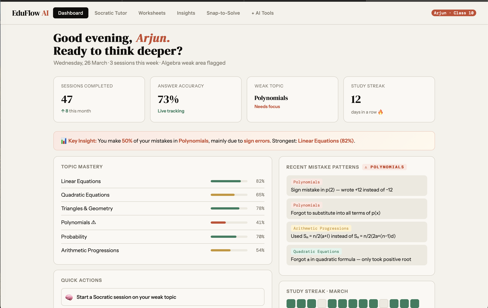
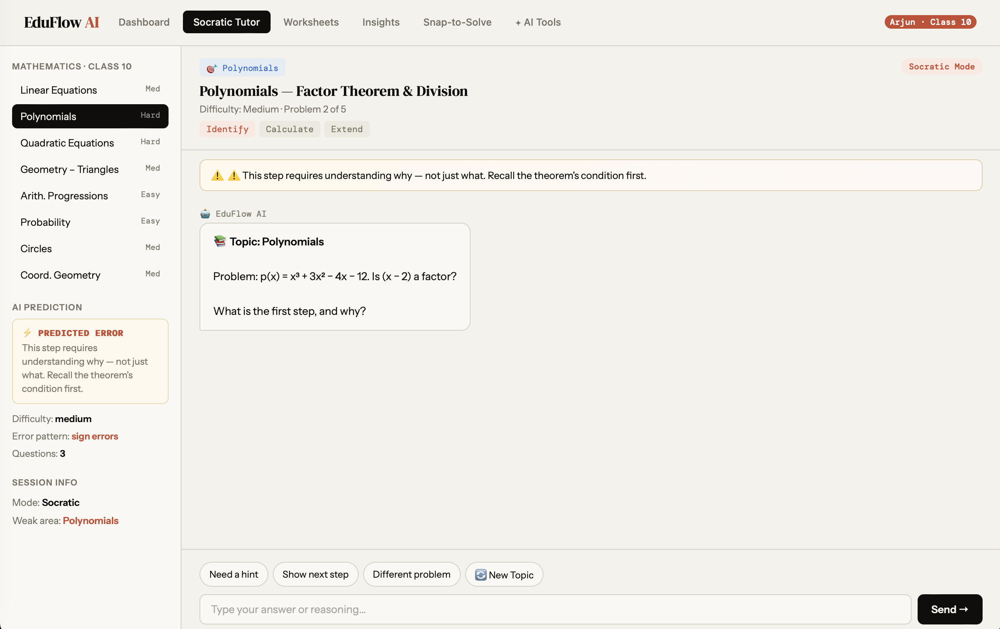

# EduFlow AI – The Socratic Learning Engine

**Tagline:** *Moving from Information to Understanding*  

---

## 📸 Screenshot / Demo

---

## 🚀 Overview

EduFlow AI helps students **master concepts** rather than just get answers.  
Traditional tuition focuses on solutions, not understanding, and many AI tools encourage passive learning.  
EduFlow AI diagnoses mistakes, tracks learning gaps, and guides students with **active problem-solving**.

---

## 🎯 Key Features

- **Socratic Tutoring Engine:** Hints and guiding questions  
- **Mistake Detection:** Step-level error tracking  
- **Knowledge Graph:** Tracks topic mastery  
- **Smart Worksheets:** Personalized practice  
- **Snap-to-Solve:** Upload notebook images for instant feedback  
- **Low Screen-Time:** Printable worksheets & audio summaries  

---

## 📊 Data & Privacy

- Uses **student interaction data**, topic mapping, and performance metrics  
- **No sensitive personal data** is required; all data remains private  

---

## 🌐 Live Demo

[EduFlow AI Live](https://eduflowai123.netlify.app)

---

## 📄 License

MIT License – see [LICENSE](LICENSE)
